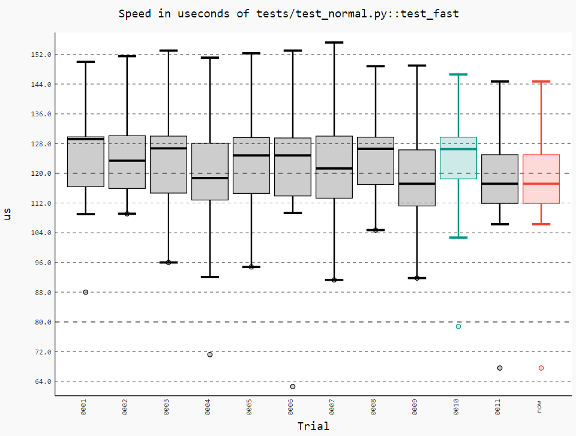

Comparing past runs
===================

Before comparing different runs it's ideal to make your tests as consistent as possible, see :doc:`faq` for more details.

`pytest-benchmark` has support for storing stats and data for the previous runs.

To store a run just add ``--benchmark-autosave`` or ``--benchmark-save=some-name`` to your pytest arguments. All the files are
saved in a path like ``.benchmarks/Linux-CPython-3.4-64bit``.

* ``--benchmark-autosave`` saves a file like ``0001_c9cca5de6a4c7eb2_20150815_215724.json`` where:

  * ``0001`` is an automatically incremented id, much like how django migrations have a number.
  * ``c9cca5de6a4c7eb2`` is the commit id (if you use Git or Mercurial)
  * ``20150815_215724`` is the current time

  You should add ``--benchmark-autosave`` to ``addopts`` in you pytest configuration so you dont have to specify it all
  the time.

* ``--benchmark-name=foobar`` works similarly, but saves a file like ``0001_foobar.json``. It's there in case you want to
  give specific name to the run.

After you have saved your first run you can compare against it with ``--benchmark-compare=0001``. You will get an additional
row for each test in the result table, showing the differences.

You can also make the suite fail with ``--benchmark-compare-fail=<stat>:<num>%`` or ``--benchmark-compare-fail=<stat>:<num>``.
Examples:

* ``--benchmark-compare-fail=min:5%`` will make the suite fail if ``Min`` is 5% slower for any test.
* ``--benchmark-compare-fail=mean:0.001`` will make the suite fail if ``Mean`` is 0.001 seconds slower for any test.

Plotting
--------

.. note::

    To use plotting you need to ``pip install pygal pygaljs`` or ``pip install pytest-benchmark[histogram]``.

You can also get a nice plot with ``--benchmark-histogram``. The result is a modified Tukey box and wiskers plot where the
outliers (the small bullets) are ``Min`` and ``Max``.

Example output:

