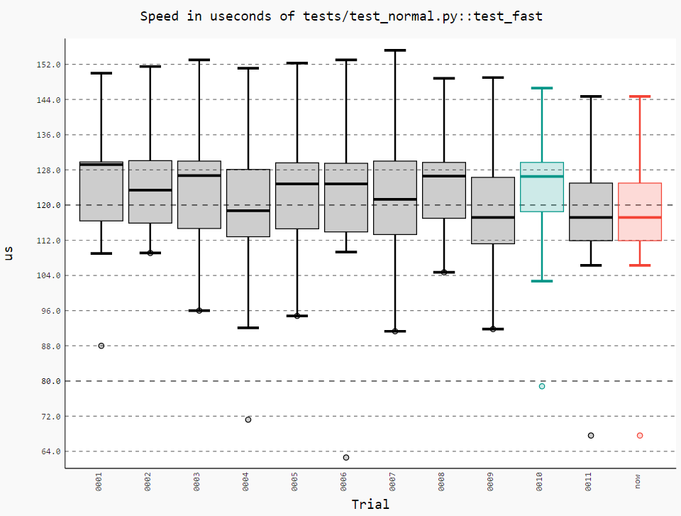

Comparing past runs
===================

Before comparing different runs it's ideal to make your tests as consistent as possible, see :doc:`faq` for more details.

`pytest-benchmark` has support for storing stats and data for the previous runs.

To store a run just add ``--benchmark-autosave`` or ``--benchmark-save=some-name`` to your pytest arguments. All the files are
saved in a path like ``.benchmarks/Linux-CPython-3.4-64bit``.

* ``--benchmark-autosave`` saves a file like ``0001_c9cca5de6a4c7eb2_20150815_215724.json`` where:

  * ``0001`` is an automatically incremented id, much like how django migrations have a number.
  * ``c9cca5de6a4c7eb2`` is the commit id (if you use Git or Mercurial)
  * ``20150815_215724`` is the current time

  You should add ``--benchmark-autosave`` to ``addopts`` in you pytest configuration so you dont have to specify it all
  the time.

* ``--benchmark-save=foobar`` works similarly, but saves a file like ``0001_foobar.json``. It's there in case you want to
  give specific name to the run.

After you have saved your first run you can compare against it with ``--benchmark-compare=0001``. You will get an additional
row for each test in the result table, showing the differences.

You can also make the suite fail with ``--benchmark-compare-fail=<stat>:<num>%`` or ``--benchmark-compare-fail=<stat>:<num>``.
Examples:

* ``--benchmark-compare-fail=min:5%`` will make the suite fail if ``Min`` is 5% slower for any test.
* ``--benchmark-compare-fail=mean:0.001`` will make the suite fail if ``Mean`` is 0.001 seconds slower for any test.

Comparing outside of pytest
---------------------------

There is a convenience CLI for listing/comparing past runs: ``pytest-benchmark`` (:ref:`comparison-cli`).

Example::

    pytest-benchmark compare 0001 0002

Comparing between source files
^^^^^^^^^^^^^^^^^^^^^^^^^^^^^^

When comparing benchmarks from multiple files (e.g. a ``main`` branch run vs. a feature branch run),
the default output shows all benchmarks in a single flat table.
The ``--compare-between`` flag pivots the table so that each row is a unique benchmark,
with columns showing the metric value from each source file and the relative change::

    pytest-benchmark compare --compare-between 0001 0002

Example output::

    -------------------------- benchmark: 9 tests, 2 sources ---------------------------
    Name (time in ns)                 0001_f41c0c7(*) Min  0002_8e68892 Min         ΔMin
    -------------------------------------------------------------------------------------
    test_getattr_thread_critical               790.93            245.80          -68.9%
    test_setattr_thread_critical               899.99            254.15          -71.8%
    ...

The first source is the reference, marked with ``(*)``.
Each subsequent source is followed by a ``Δ`` column showing the percentage change.

You can control which metrics are shown per source with ``--columns`` and the sort order with ``--sort``::

    pytest-benchmark compare --compare-between --sort=mean --columns=min,mean 0001 0002

Plotting
--------

.. note::

    To use plotting you need to ``pip install pygal pygaljs`` or ``pip install pytest-benchmark[histogram]``.

You can also get a nice plot with ``--benchmark-histogram``. The result is a modified Tukey box and whisker plot where the
outliers (the small bullets) are ``Min`` and ``Max``. Note that if you do not supply a name for the plot it is recommended
that ``--benchmark-histogram`` is the last option passed.

Example output:

